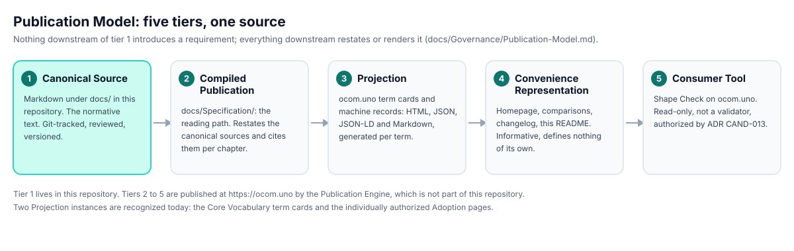

  

<h1 align="center">OCOM</h1>

<strong>Object-Centric Operating Model</strong> 
An open, technology-independent specification that describes an organization as a system of governed objects with identity, ownership, lifecycle and evidence.

  
  
  
  
  
  
  
  
  

## What OCOM is

OCOM is a specification in the RFC tradition. It defines a vocabulary and a set of rules for describing how an organization operates: which objects exist, who answers for them, how they change state, and what evidence stands behind each claim about them. Everything else an organization produces about itself, dashboards, documents, graphs, search indexes, AI-agent context, is treated as a rebuildable projection of that governed source, never as a second source of truth.

The specification governs its own evolution. Its core is frozen under an Architecture Freeze, changes enter through documented Reference Cases, and the tensions it has not resolved are published as numbered Architecture Observations rather than patched by wording.

## What OCOM is not

- Not a product, not a SaaS, not a database schema. Nothing to install, nothing to buy, no commercial offer anywhere in the text.
- Not a notation for diagrams (see the comparisons with BPMN and ArchiMate) and not a software design discipline (see the comparison with Domain-Driven Design).
- Not finished. The Core Vocabulary is at 0.1, the reading path at 0.2, and the specification says so on every page.

## Read it

| Where to start | What you get |
|---|---|
| [Executive Overview](https://ocom.uno/specification/executive) | One page: the idea, the four pillars, how the chapters fit |
| [Specification reading path](https://ocom.uno/specification) | Chapters 1 to 8 compiled from the canonical sources in this repository |
| [Core Vocabulary](https://ocom.uno/vocabulary) | The 13 governed terms, each published as HTML, JSON, JSON-LD and Markdown |
| [How to review](https://ocom.uno/specification/how-to-review) | The nine questions a reviewer, human or automated, is asked to answer |
| [Evidence Register](https://ocom.uno/evidence-register) | What is verified, what is declared, and what is absent, stated honestly |
| [Knowledge API](https://ocom.uno/api) | `/api/v1`: terms, resolver, explain, neighbors, graph, governance |
| [llms.txt](https://ocom.uno/llms.txt) | The machine-readable entry point for AI agents |
| [Why I wrote it](https://ocom.uno/why) | The origin and the motivation, in the author's words |

Prefer the repository? Start with [`docs/README.md`](docs/README.md), then [`docs/Specification/00 Executive Overview.md`](docs/Specification/00%20Executive%20Overview.md). The 13 term definitions live in [`docs/Meta/`](docs/Meta/README.md). [`docs/PROJECT_STATUS.md`](docs/PROJECT_STATUS.md) is the one-page snapshot of what is released, what is baseline and what is still open.

## How the text is governed

- [Constitution v1.0](docs/Core/Constitution.md): the canonical principles, amended only through an RFC-like process.
- [Architecture Freeze](docs/Governance/ADR-Candidates.md) (ADR Candidate CAND-007): no new Core concept, no reworded Canonical Principle, until the freeze is lifted through the change process.
- [ADR Candidates](docs/Governance/ADR-Candidates.md): 13 recorded decisions and proposals, CAND-001 to CAND-013.
- [Architecture Observations](docs/Governance/Architecture-Observations.md): 58 recorded tensions, AO-001 to AO-058, including the ones the specification's own site found when it audited itself.
- [Standard Evolution Methodology](docs/Governance/Standard%20Evolution%20Methodology.md): how a Reference Case becomes an observation, a candidate and, eventually, a change.

Found something the text gets wrong? Open a [Reference Case](.github/ISSUE_TEMPLATE/reference-case.md). Found two rules that contradict each other? Open an [Architecture Observation](.github/ISSUE_TEMPLATE/architecture-observation.md). Found a page on ocom.uno that disagrees with the file it names as its source? Open a [Projection defect](.github/ISSUE_TEMPLATE/projection-defect.md).

## One source, five tiers

This repository is tier 1. The site at [ocom.uno](https://ocom.uno) publishes tiers 2 to 5 from it and checks its own projections against the source after every build; the results are public in the [Observatory](https://ocom.uno/observatory). The rules are in [`docs/Governance/Publication-Model.md`](docs/Governance/Publication-Model.md).

## Repository structure

Everything normative is Markdown under `docs/`. There is no code in this repository.

- [`Adoption/`](docs/Adoption/README.md): Quick Start, First Pilot, FAQ, Common Mistakes. Informative; start here if new.
- [`AI/`](docs/AI/): AI agents, context, evaluation, knowledge, prompts, tools.
- [`Core/`](docs/Core/): Constitution, Manifest, principles, naming, versioning, modeling rules, terminology.
- [`Domains/`](docs/Domains/): 13 business domain profiles.
- [`Entities/`](docs/Entities/): reference entity catalog.
- [`Examples/`](docs/Examples/): worked examples and the Reference Case, distilled from real rollouts under NDA with the organization and details changed. Informative.
- [`Governance/`](docs/Governance/README.md): how the specification itself is maintained, reviewed and evolved. Baseline.
- [`Language/`](docs/Language/): notation, syntax, schema, vocabulary, conformance rules.
- [`Lifecycles/`](docs/Lifecycles/): commercial, content, financial, operational and organizational lifecycle patterns.
- [`Memory/`](docs/Memory/): layered memory, evidence overlay, retention, write-back governance.
- [`Meta/`](docs/Meta/README.md): the 13 Core Vocabulary terms.
- [`Models/`](docs/Models/): domain, entity, event, lifecycle, relationship, state and workflow models.
- [`Reference Architecture/`](docs/Reference%20Architecture/): enterprise, domain, object, business-event, memory and AI architecture views. Informative.
- [`Specification/`](docs/Specification/): the v0.2 sequential reading path through the normative text. Baseline.
- [`Workflows/`](docs/Workflows/): workflow specifications, planned.

## Status

- Core Vocabulary v0.1: released 21 July 2026 with 12 terms; Organization was added on 25 July 2026 through ADR CAND-005, bringing the set to 13. The 0.1 label did not change on either date, and the [Publication Manifest](docs/Governance/Publication-Manifest.md) records that.
- Specification v0.2 reading path and Governance: baseline. Baseline means reviewed and frozen pending the change process, not finished.
- Constitution v1.0: adopted through ADR CAND-006; Architecture Freeze in force through CAND-007.
- Evidence: one Reference Case published; reference implementations, verified implementations and independent validations all stand at zero, and the [Evidence Register](https://ocom.uno/evidence-register) says so.

See [`ROADMAP.md`](ROADMAP.md) for what is done, what is open and what is under exploration, and [`CHANGELOG.md`](CHANGELOG.md) for the record of changes.

## Cite

The concept DOI always resolves to the most recent archived version. GitHub also offers "Cite this repository" from [`CITATION.cff`](CITATION.cff).

> Petrenko, D. (2026). OCOM: the Object-Centric Operating Model specification. <https://ocom.uno>. <https://doi.org/10.5281/zenodo.21510450>. CC BY 4.0.

## License

- Specification text, everything under `docs/`: [Creative Commons Attribution 4.0](LICENSE-docs.md) (CC BY 4.0).
- Everything else in this repository: [Apache License 2.0](LICENSE).

The OCOM name and logo identify this specification; see [Attribution](https://ocom.uno/attribution).

## Contributing

Read [`CONTRIBUTING.md`](CONTRIBUTING.md) and the [Code of Conduct](CODE_OF_CONDUCT.md) first. Objections and evidence enter through the issue templates above; pull requests that touch the frozen core are routed back to a Reference Case. Security concerns follow [`SECURITY.md`](SECURITY.md).

## Disclaimer

OCOM is an early-stage specification. The v0.1 Core is released; Governance and the Specification v0.2 reading path are baseline, which means reviewed and frozen pending the approved change process, not that the specification is finished. Terminology, structure and scope may still change through that process before v1.0. Content is provided as is, without warranty.
