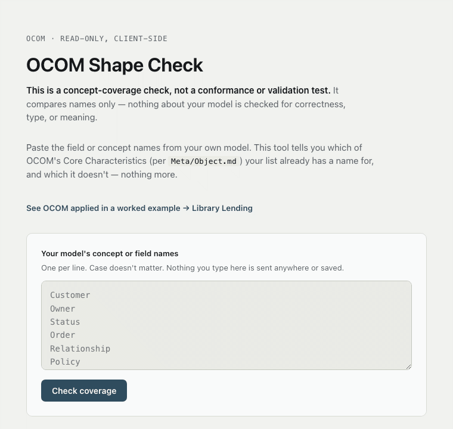

<!-- nav:start -->
[Docs](../README.md) / [Adoption](README.md) / Worked Example - Library Lending

[↑ Up](README.md)

---
<!-- nav:end -->

# Worked Example — Library Lending

**Document ID:** ADOPTION-WORKED-EXAMPLE-01

**Status:** Informative

**Version:** 0.1

---

## Purpose

This is one worked example, showing how OCOM's Core Characteristics (defined in `Meta/Object.md`) apply together to a single, deliberately ordinary domain: a library lending books to patrons. It exists to answer one question in under ten minutes: "what does it actually look like when OCOM is applied to something?"

This document is **Informative**, not normative. It introduces no new concept, defines no new type, and adds no requirement. Every characteristic it demonstrates is illustrated with example values, not prescribed ones — nothing here is a schema, and nothing here should be read as OCOM's own definition of anything. Where this example says less than, or differs in emphasis from, the normative sources it cites, the normative sources prevail — the same rule `Examples/Overview.md`'s own Conformance section states for the Examples/ directory.

## The Domain

A library lends physical items (books, journals, media) to registered patrons. This domain was chosen deliberately for being familiar without requiring any industry expertise, and for not being any organization's real business — see `Governance/ADR-Candidates.md#cand-010` for why a domain-neutral example was required.

Two Objects participate: a **Patron** and an **Item**. What connects them is a **Relationship**, not a hierarchy.

## Identity

Every Object requires Identity (`Meta/Identity.md`) — something that uniquely identifies it and remains unchanged through its Lifecycle.

- Patron: `P-10432` — assigned once, at registration, never reused.
- Item: `LIB-000198` — an accession number, assigned once per physical copy, distinct from the title itself (two copies of the same book are two Items, two Identities).

## Ownership

Every Object requires Ownership (`Meta/Ownership.md`), which itself requires an Identifier, an Owner, an Owned Object, a Responsibility Scope, and an Effective Date.

- Identifier: `OWN-LIB-000198`.
- Owner: the library's Riverside Branch.
- Owned Object: Item `LIB-000198`.
- Responsibility Scope: the branch is accountable for the Item's condition and availability, not for how the Patron uses it once borrowed.
- Effective Date: the date the branch's copy entered circulation, e.g. `2024-03-11`.

Ownership answers *who is accountable for this Object*. It does not answer who currently possesses it — that's what the Relationship below is for.

## Relationship

Every Object requires Relationships (`Meta/Relationship.md`), which itself requires an Identifier, a Source Object, a Target Object, and a Relationship Type.

- Identifier: `LOAN-2026-08-0431`.
- Source Object: Patron `P-10432`.
- Target Object: Item `LIB-000198`.
- Relationship Type: `Borrows`.

This is the entire structural shape of a loan: one Relationship record connecting two Objects. Nothing about a due date, a fine, or a renewal is required by `Relationship.md` itself — those would be illustrative, optional fields (`Relationship.md`'s own "may additionally define": Validity Period, Status, Constraints), not shown here to keep the example to what's actually required.

## Lifecycle

`Meta/Object.md` names Lifecycle as one of every Object's seven Core Characteristics. The normative structure of what a Lifecycle actually consists of is defined separately, in `Models/Lifecycle.md` — which describes it at the Entity level (its own text speaks only of "Entity," e.g. "Every Entity shall have exactly one Lifecycle"), not as an independent Object-level definition. This example follows `Meta/Object.md`'s characteristic and borrows `Models/Lifecycle.md`'s structural shape (one initial State, one or more operational States, defined Transitions, optional terminal States) without claiming that document itself makes any statement about Object in general.

Item `LIB-000198`'s Lifecycle, illustrated:

```text
Available → On Loan → Overdue → Returned → Available
                    ↘ Lost / Withdrawn
```

These state names are illustrative, not a normative enumeration — `Models/Lifecycle.md` defines the structural rules a Lifecycle must satisfy (an initial State, permitted Transitions, optional terminal States), not a fixed list of state names for any particular kind of thing, and this example does not invent one on the specification's behalf.

## Metadata and Classification

Every Object requires Metadata and Classification (`Meta/Metadata.md`, `Meta/Classification.md`).

- Item Metadata (descriptive): title, author, edition.
- Item Classification: `Book` — distinguishing it from `Journal` or `Media`, the library's other Item types.

## What This Example Does Not Show

Two concepts are absent from this example, deliberately, and for two different reasons:

**Governance** is one of Object's seven Core Characteristics (`Meta/Object.md`) — required, not optional. It is not demonstrated here because no OCOM document defines what Governance means as a per-Object characteristic (distinct from `docs/Governance/`, which governs the specification itself). This is a real, open gap in OCOM, not something this example can honestly fill in. See `Governance/ADR-Candidates.md#cand-010`.

**Evidence** is not one of Object's Core Characteristics at all, and its absence here is a different kind of fact than Governance's. It is a Constitution-level principle (`Core/Constitution.md`, Principle 3) and a Memory-tier concept (`Memory/Evidence Overlay.md`), a different document layer than the one this example illustrates — there is nothing missing here to fill in.

Neither is a limitation of the library domain specifically — the same two facts hold for any Object this example could have chosen.

## Status of This Example

Illustrative only. Conformance to OCOM is determined exclusively by the normative Specification, never by this document — the same principle `Examples/Overview.md` states for its own examples. This example does not constitute a Reference Implementation and makes no Conformance claim.

## Try This on Your Own Model

**Try OCOM on your own model → [Shape Check](https://claude.ai/code/artifact/b331b03b-1f22-4796-a907-8df6f66bd126)**

A separate, read-only tool: paste your own model's field names and see which of the Core Characteristics above it already has a name for. It is not part of this Specification, not a validator, and not authorized or governed by any OCOM ADR — see the tool's own page for exactly what it checks and doesn't.

See OCOM Shape Check in action



Try it yourself → [Shape Check](https://claude.ai/code/artifact/b331b03b-1f22-4796-a907-8df6f66bd126)

## Run a First Pilot

**Try OCOM on your own team → [First Pilot](https://github.com/DenisHogberg/OCOM/blob/main/docs/Adoption/First%20Pilot.md)**

---

*Source: illustrates `Meta/Object.md`'s Core Characteristics (Identity, Metadata, Classification, Relationships, Lifecycle, Ownership), `Meta/Identity.md`, `Meta/Ownership.md`, `Meta/Relationship.md`, `Meta/Metadata.md`, `Meta/Classification.md`, and `Models/Lifecycle.md`. Authorized as a single, scope-limited work item under `EPIC-F` by `Governance/ADR-Candidates.md#cand-010` (Decided, 21 August 2026).*
