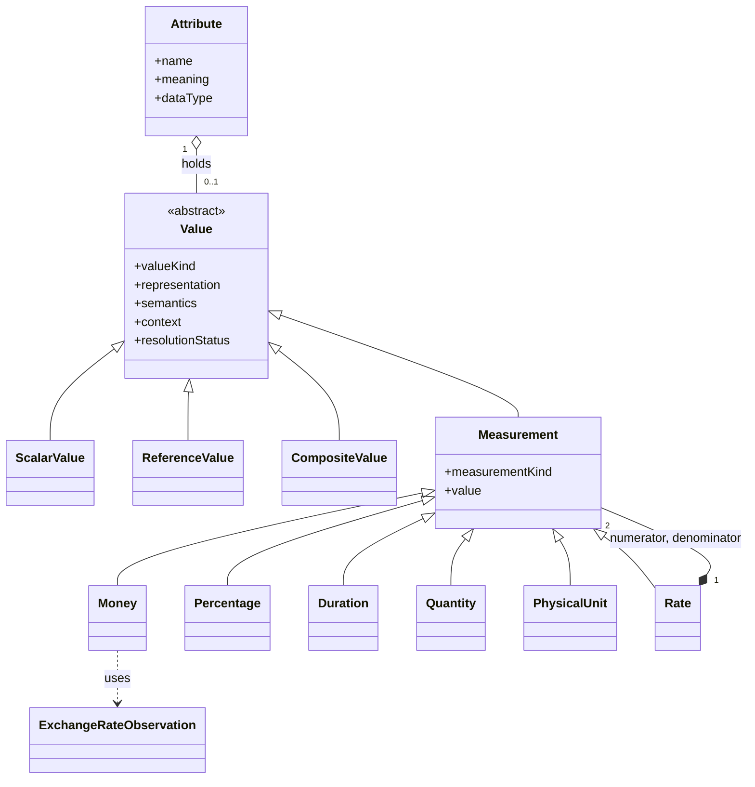

<!-- nav:start -->
[Docs](../README.md) / [Governance](README.md) / Concept Paper — Value Model

[← Back](ADR-Candidates.md) · [↑ Up](README.md)

---
<!-- nav:end -->

# Concept Paper — Value Model (with Measurement as its First Realized Value Kind)

**Document ID:** GOV-CONCEPT-VALUE-MODEL-01

**Status:** Informative

**Version:** 0.1

**Last Updated:** 29 July 2026

---

# Purpose

`AO-005` found, on two independent Reference Cases (`RC-006`, `RC-007`), that `Models/Entity.md`'s Attribute "data type" facet has no structure for what a value's content must self-describe. This paper is the attached design for `CAND-008`. It does not itself change any specification document — per the Architecture Freeze (`CAND-007` §5/§6), it is Informative material for the Chief Architect's review, exactly as `Concept-Paper-Knowledge-vs-World-Model.md` served `AO-003`.

It proposes a general **Value** Meta-construct rather than a narrow Measurement-only addition, because Measurement alone would be a point solution: it would resolve the quantitative case this paper has evidence for, while leaving the same unstructured "data type" gap open for every other kind of Attribute content. **Value** names the gap once, at the right level; **Measurement** is presented here as its one fully-specified realization, because it is the only Value Kind this filing has Reference Case evidence for.

---

# 1. Value

## 1.1 Definition

A Value is the self-describing content held by an Attribute's data-type facet (`Models/Entity.md`: "Each attribute shall have: name; meaning; data type; optional constraints"). A Value states not only its raw content, but the Kind of content it is, the representation that content uses, the semantics that content carries, and the context under which it was asserted true.

A Value never possesses independent identity, ownership, evidence, or lifecycle. It is always held by exactly one Attribute of exactly one Object, and composes with that Object's existing governance rather than duplicating it (Modeling Rule 8 — Models Must Avoid Duplication).

## 1.2 Business Meaning

A Value lets any consumer of an Attribute — human or AI agent — determine what a piece of content means without inferring an undocumented assumption from context, tribal knowledge, or convention. This is the same interoperability goal `Meta/Object.md` states for Objects generally, applied specifically to the content an Attribute holds.

## 1.3 Design Principles

A Value shall:

- declare its Value Kind explicitly — never inferred from raw content alone;
- be self-describing — representation and semantics travel with the value itself, not in a sibling Attribute or in external documentation;
- support an explicit Resolution Status distinguishing "known to be absent," "known to be zero/empty," and "not yet disambiguated" — an extraction process must be able to say "I found a number but not its unit" honestly, rather than defaulting one in;
- never carry its own identity, ownership, evidence, or lifecycle;
- remain extensible — new Value Kinds may be introduced without modifying this document, the same pattern `Meta/Classification.md` uses for Classification Types and `Meta/Relationship.md` uses for Relationship Types;
- remain technology independent.

## 1.4 Core Characteristics

Every Value shall define:

- **Value Kind** — an open, extensible registry (e.g. Measurement, and the named-but-unspecified kinds in §1.5).
- **Representation** — how that Kind's raw content is encoded.
- **Semantics** — what the content means within its Kind.
- **Context** — the conditions under which the Value is asserted true.
- **Resolution Status** — Resolved / Partially Resolved / Unresolved.

## 1.5 Value Kinds

Four Value Kinds are named. Only one is specified in this filing.

- **Measurement** — quantitative business facts. Fully specified in Section 2, because two independent Reference Cases evidence its boundary concretely.
- **ScalarValue** — simple text/boolean/date content (e.g. an Identifier vs. free text; a calendar date vs. a business date; locale-dependent formatting). Real ambiguity plausibly exists here, but no Reference Case in this filing evidences it. Named only.
- **ReferenceValue** — a Value that is itself a pointer to another Object, held by an Attribute rather than expressed as an Object-level Reference (`Meta/Object.md`'s "Object References" section describes Object-to-Object references generally; this is the distinct, narrower case of an Attribute whose content is a pointer). Named only.
- **CompositeValue** — structured or nested content composed of other Values. Named only.

Naming ScalarValue, ReferenceValue, and CompositeValue without specifying them keeps Measurement from being mistaken for the whole of the gap, and applies the same restraint `AO-004`'s Recommendation used for its own open question — deliberately not choosing among plausible directions without evidence for any one of them. Fully designing them now, on no evidence, would itself violate Minimal Core (`Standard Evolution Methodology.md`): "A Reference Case that can be fully expressed using existing Core concepts is evidence the Core is sufficient, not evidence that it is incomplete." The inverse also holds — a Value Kind should not be designed before a Reference Case demonstrates it is needed.

---

# 2. Measurement — the First Realized Value Kind

Measurement's fields are concrete fillings-in of Value's five Core Characteristics, not a parallel structure:

| Value Characteristic | Measurement's filling |
|---|---|
| Value Kind | `measurementKind`: Money \| Percentage \| Duration \| Quantity \| PhysicalUnit \| Rate |
| Representation | `unit` + `precision` |
| Semantics | kind-specific: Percentage's `representation`/`semantic`; Quantity's `unitLabel`/`discrete`; Duration's `calendarBasis` |
| Context | `valuationTime` |
| Resolution Status | `unresolved: true` when extracted without a stated unit — never defaulted |

Every Measurement additionally carries a `value` (arbitrary-precision numeric — never float-only, since Money precision loss is unacceptable) and an optional `display` field for cosmetic rendering only, never used in computation.

## 2.1 Money

| Field | Meaning |
|---|---|
| `amount` | Arbitrary-precision numeric magnitude. |
| `currency` | ISO 4217 alpha code, when applicable. |
| `currencyScheme` | `iso4217` \| `crypto` \| `organization-defined` — covers BTC/ETH and similar, which have no ISO 4217 code. |
| `precision` | Number of significant decimal places the amount is authoritative to; defaults to the currency's ISO 4217 minor-unit count (2 for USD, 0 for JPY) but is explicit for schemes without one. |
| `valuationTime` | The point in time the amount was true — non-optional; a Money value without a timestamp cannot be normalized once more than one currency is in play. |
| `normalized` | Optional: `{baseCurrency, baseAmount, exchangeRate}` — an inline instance of §2.7 (ExchangeRateObservation), for a base-currency figure computed alongside the original. |

Example (illustrative figures, corrected to be self-describing — matching the ambiguity class RC-006 identified, without reproducing its source figures):

```
Money
  amount = 10000
  currency = USD
  currencyScheme = iso4217
  precision = 2
  valuationTime = 2026-07-29
  normalized:
    baseCurrency = EUR
    baseAmount = 8543
    exchangeRate = 0.8543
```

## 2.2 Percentage

| Field | Meaning |
|---|---|
| `value` | The numeric magnitude, in whichever `representation` states. |
| `representation` | `percent` (e.g. 35) \| `fraction` (e.g. 0.35) — states how `value` is encoded; both normalize to the same canonical fraction. |
| `semantic` | `ratio` \| `percentagePoints` \| `score` — this is the field that resolves the task's own "35 = 35%? 0.35? a score?" ambiguity directly. A `percentagePoints` value is a *delta between two ratios* (e.g. "conversion improved by 5") and is never itself divisible by 100 into a fraction of a whole. A `score` (any number that merely happens to be scaled 0–100 without being a ratio of a whole, such as a satisfaction score) is explicitly **not** a Percentage at all — it must use Quantity instead. This is the rule that keeps "35 as a plain score" from ever being mis-typed as a Percentage. |
| `baseDescription` | Optional free text or Object reference: what the "whole" is (e.g. "ratio of Deal.amount to target"). |

## 2.3 Duration

| Field | Meaning |
|---|---|
| `value` | Numeric magnitude. |
| `unit` | `millisecond` \| `second` \| `minute` \| `hour` \| `day` \| `week` \| `month` \| `year`. |
| `calendarBasis` | `fixed` \| `calendar` — required for `month`/`year`, since neither is a fixed length; `fixed` states an explicit conversion (e.g. 1 month = 30 days by convention), `calendar` requires an anchor. |
| `boundedBy` | Optional `{from, to}` timestamps — lets a Duration be reconstructed from two Events (`Models/Event.md`) rather than stated as a bare number; recommended whenever the underlying Events exist. |

## 2.4 Quantity

| Field | Meaning |
|---|---|
| `value` | Numeric magnitude. |
| `unitLabel` | A singular business noun, per `Core/Naming.md`'s own Attribute-naming convention (e.g. "meeting," "user," "order"). |
| `unitDomain` | Optional Domain reference, disambiguating homonyms ("order" in Sales vs. Operations). |
| `discrete` | Boolean — governs whether summing across instances is valid (a count) or invalid (an average-only measure). |

Quantity is the fallback Kind for countable business nouns. It must never be used for money, percentages, durations, or physical quantities — those already have their own Kind precisely so an AI agent never has to guess which applies.

## 2.5 PhysicalUnit

| Field | Meaning |
|---|---|
| `value` | Numeric magnitude. |
| `dimension` | Length \| Mass \| Volume \| Temperature \| DataStorage \| NetworkTraffic \| Energy, etc. — a governed, extensible registry. |
| `unit` | Must belong to the declared `dimension`'s registered unit set (a Constraint, per `Meta/Constraint.md`). |
| `temperatureKind` | `absolute` \| `delta` — only for Temperature; an absolute reading and a change-in-temperature are not interchangeable, the same distinction Percentage draws between `ratio` and `percentagePoints`. |

Each dimension declares exactly one canonical SI (or SI-derived) base unit for normalization: Length→metre, Mass→kilogram, Volume→litre, Temperature→kelvin, DataStorage→byte, Energy→joule.

## 2.6 Rate

A Rate is a composite of two Measurements, never a bare number:

| Field | Meaning |
|---|---|
| `numerator` | A Measurement (typically Money, Quantity, or PhysicalUnit). |
| `denominator` | A Measurement (typically Duration, or a Quantity such as "per order"). |
| `window` | The averaging window the rate was computed over (instantaneous, trailing-7-day-average, etc.) — two Rates are not comparable unless their `window`s match or are explicitly reconciled. |

Example: Revenue/day = `numerator: Money(10000 USD)` / `denominator: Duration(1 day)`, `window: trailing-30-day-average`.

## 2.7 ExchangeRateObservation

Provider-agnostic — no vendor is mandated:

| Field | Meaning |
|---|---|
| `baseCurrency`, `quoteCurrency` | The pair. |
| `rate` | Fixed direction: "1 unit of `baseCurrency` = `rate` units of `quoteCurrency`" — stated explicitly to remove the classic base/quote direction ambiguity. |
| `observedAt` | Timestamp the rate was true. |
| `rateType` | `spot` \| `closing` \| `average` \| `contractual` \| `organization-defined` — a booked deal using a contractually fixed rate must never be silently replaced by a live market rate. |
| `providerReference` | Free text (name/URL/internal system) — deliberately unconstrained. |

Recommended (§5): `ExchangeRateObservation` should itself carry Evidence, the same discipline already applied elsewhere to non-terminal, non-self-evidencing record types.

## 2.8 Unit Normalization — the AI comparison procedure

1. Confirm both Measurements share the same `measurementKind`. Reject comparison across kinds (Money vs. Duration is meaningless).
2. Convert both to the kind's canonical base unit, using a *recorded* conversion — a static factor for time/SI units, an `ExchangeRateObservation` valid at or near the relevant `valuationTime` for Money. If no such conversion is available, the comparison fails closed — it is never guessed.
3. Compare or aggregate only after conversion.
4. Never sum values whose `unit` differs without normalizing first; never sum Quantities of different `unitLabel`; never average where summing was intended, or the reverse — respect the `discrete` flag.

Worked against the task's own three examples: 100 USD vs. 90 EUR requires an `ExchangeRateObservation` near both `valuationTime`s; 2 hours vs. 120 minutes is a static factor of 3600 seconds; 10 km vs. 6000 m is a static SI factor of 1000.

---

# 3. Conceptual Diagram



`ScalarValue`, `ReferenceValue`, and `CompositeValue` appear only as named leaves — no internal structure is proposed for them here.

---

# 4. Integration with OCOM

**Objects / Attributes.** Value is a new normative data type available to an Attribute (`Models/Entity.md`), not a new Object and not a new Entity — this is why it does not trip the Freeze's "no new Entity types" line. An Attribute whose content is quantitative SHOULD use a Measurement Value rather than a bare number, going forward.

**Evidence.** A Value carries no Evidence of its own — it inherits whatever Evidence already governs the Attribute/Object assertion it belongs to (Modeling Rule 8). The one exception is `ExchangeRateObservation` (§2.7, §5): when treated as its own record rather than purely inline metadata, it should carry Evidence itself, on the same terms Vector already applies to its ten Evidence-Required object types — a rate observation is exactly the kind of externally-sourced fact that discipline exists for.

**Lifecycle.** A Value has no independent lifecycle. A superseding value is appended, not overwritten, per `Meta/Metadata.md`'s "history should be retained" — this matters most for Money, where the exchange rate a past figure was normalized against must remain reconstructable.

**Relationships.** Rate's `numerator`/`denominator` is internal composition, not an OCOM Relationship between Entities (`Meta/Relationship.md`) — it is how one Value is built, not a governed association between two Objects. This keeps Rate lightweight and avoids requiring full Relationship governance for an internal structural detail.

**Governance.** New Value Kinds, currency codes, unit-of-measure dimensions, and duration units are additive, Minor-version registry extensions (`Core/Versioning.md`), the same extensibility already used for Classification Types (`Meta/Classification.md`) and Relationship Types (`Meta/Relationship.md`) — none require a Major version or a Constitution amendment.

---

# 5. Examples

- **Money:** §2.1's worked example, illustrating RC-006's boundary class (a debt figure and a tax figure), corrected: both require an explicit `currency` (per RC-006, neither source call ever stated one — recorded as `unresolved: true` until confirmed).
- **Percentage:** ROI = 35, `representation: percent`, `semantic: ratio` → canonical fraction 0.35. Contrast: "conversion improved by 5" → `semantic: percentagePoints`, never treated as 0.05 of anything.
- **Duration:** Project duration = 30, `unit: day`, `calendarBasis: fixed`; contrast a vacation given in weeks, same treatment, both safely comparable because both are fixed-length units — the RC-006 boundary this resolves.
- **Quantity:** 15 meetings (`unitLabel: meeting`, `discrete: true`); 230 users (`unitLabel: user`, `discrete: true`); 4 action items; 120 orders (`unitDomain: Sales`, to disambiguate from an Operations "order").
- **PhysicalUnit:** distance 120, `dimension: Length`, `unit: km` → base metres = 120000.
- **Rate:** Revenue/day = `numerator: Money(10000 USD)` / `denominator: Duration(1 day)`, `window: trailing-30-day-average`.
- **"Which project generated the highest revenue?"** — gather every Project's revenue Measurement (`measurementKind: Money`) → normalize each to one declared base currency via an `ExchangeRateObservation` at or near its own `valuationTime` → compare only the normalized amounts → report the maximum, citing which rate observations were used. A Project whose revenue is `unresolved` is excluded and named as excluded, never assigned a guessed currency.
- **"Which team had the highest cost per completed task?"** — build a Rate per team: `numerator: Money(total cost)` / `denominator: Quantity(completed tasks, discrete: true)` → compare only Rates with matching `window`s.

---

# 6. Edge Cases

- Non-ISO currencies (BTC, ETH, etc.) — `currencyScheme: crypto`, no ISO 4217 code required.
- Negative Money (refunds, losses) — valid; sign is meaningful, never an error condition.
- Explicit zero vs. absent value — an absent Attribute means "unknown"; a Measurement present with `value: 0` means "known to be exactly zero." These are never conflated.
- Percentage outside 0–100 (grew 150%, ROI of −20%) — valid, never clamped.
- Mixed-precision aggregation — Money values with different `precision` are summed at full internal precision; rounding to a coarser `precision` happens only at display time.
- Stale or missing exchange rate — comparison fails closed ("cannot compare — no rate within tolerance"), never silently substitutes an old or default rate.
- Mismatched Rate `window`s — two Rates are never compared unless their windows match or are explicitly reconciled first.
- Calendar-crossing Duration (a month spanning a leap year, variable month lengths) — requires `calendarBasis: calendar` with explicit anchor dates, never a fixed-day assumption.
- The motivating case itself: a value extracted from unstructured text (a meeting transcript, a chat message) with no stated unit must be recorded `unresolved: true` by the extracting process — never defaulted to a currency, a time unit, or a representation guessed from context.

---

# 7. Recommendations

- Measurement is RECOMMENDED for new quantitative Attributes going forward; existing bare-number Attributes are not retroactively broken (§8).
- Currency codes, unit-of-measure dimensions, and duration units should be maintained as their own small, independently-versioned governed reference lists, rather than enumerated inside this document, so they can grow without reopening it.
- An AI agent encountering an `unresolved` Value should abstain and surface the ambiguity, not guess — the same posture `Meta/Constraint.md`'s "Pending Verification" state already models for constraint evaluation.
- A product implementing this Model (Reader, Vector, or any other) should expose the §2.8 comparison procedure as a single governed capability, rather than each implementation re-deriving its own ad hoc comparison logic — named here as a recommendation for implementers, not as a Specification requirement on any one of them (Principle 1).

---

# 8. Migration Strategy

This is an additive, Minor-version change (`Core/Versioning.md`) if adopted — no existing document breaks.

- **Phase 1:** `Meta/Value.md` is published alongside the existing Attribute data-type facet, with Measurement as its one specified Value Kind.
- **Phase 2:** New or revised Domain specifications SHOULD adopt Measurement for quantitative Attributes going forward. `Finance_KPIs.md`'s "average processing time," `Operations_KPIs.md`'s "Average Execution Time"/"Milestone Achievement Rate," and `BI_Objects.md`'s "Ratio" are named, concrete candidates for a follow-up retyping pass — not part of this filing, and not required for `CAND-008` to be decided.
- **Phase 3:** Existing bare-number Attributes, including `Core/Naming.md`'s own "Amount"/"Currency" sibling-attribute example, are grandfathered. Both forms — sibling attributes and a single Measurement Value — may coexist during a transition window, consistent with `Core/Versioning.md`'s "Minor and Patch releases should remain backward compatible whenever possible."
- **Phase 4:** No Major version is required unless Measurement (or Value generally) is later made retroactively mandatory for all existing quantitative Attributes — a distinct, future, and explicitly deferred Decision, not implied by this filing.

---

# 9. Conformance

A Value conforms to this paper's proposal only if it declares all five Core Characteristics (§1.4). A Measurement conforms only if it declares the fields specified for its `measurementKind` in Section 2. Neither Value nor Measurement is normative until `CAND-008` is decided — this section states the conformance shape being proposed, not an adopted requirement.

---

# Status

This paper is the attached design for `CAND-008`, itself filed on `AO-005`. No specification document has been changed by this paper. Resolution belongs to the standard evolution process, on the terms `AO-003`/`Concept-Paper-Knowledge-vs-World-Model.md` already used.

---

# Revision History

| Version | Date | Description |
|----------|------|-------------|
| 0.1 | 29 July 2026 | Initial concept paper: Value Model generalized from the original Measurement-only submission, per author direction, with Measurement specified as Value's first realized Value Kind; written from `AO-005` (`RC-006`, `RC-007`) |
